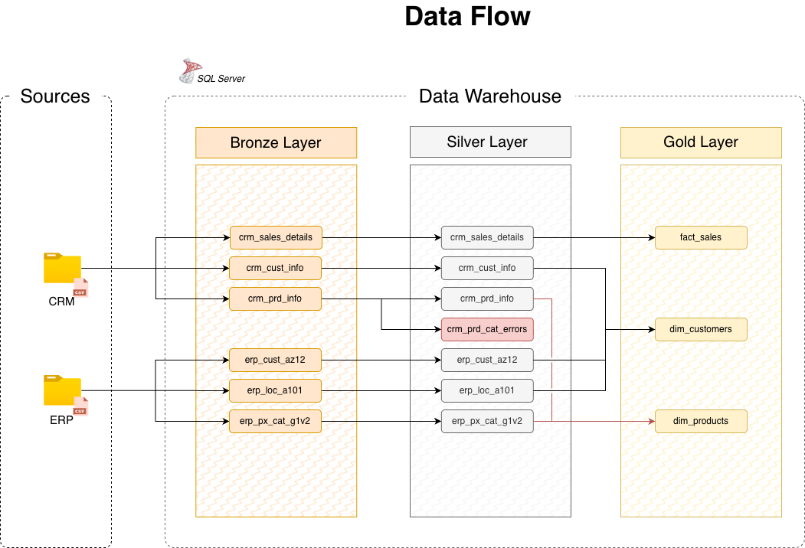

## Enterprise Sales Data Warehouse (Medallion Architecture)

This repository contains a full SQL-based Data Warehouse implemented on SQL Server.
The project demonstrates modern data engineering practices used in enterprise environments: Medallion Architecture, ETL pipelines, data quality controls, dimensional modeling, and analytical data marts.

## 1. Architecture Overview

The solution follows the Medallion model (Bronze → Silver → Gold):

Bronze Layer
Stores raw CRM and ERP datasets ingested from CSV files.
No transformations are applied; tables represent source systems as-is.

Silver Layer
Cleansed and standardized data.
Includes data validation, trimming, null handling, normalization, derived columns, and enrichment from multiple sources.
Invalid or inconsistent records are isolated into error tables.

Gold Layer
Business-ready data modeled as a star schema:
- fact_sales
- dim_customers
- dim_products

Designed for reporting, analytics, and ad-hoc SQL queries.

## 2. Data Flow

Data is ingested from two sources:

- CRM: sales, customer, product data
- ERP: locations, customers, product categories

  Bronze → Silver pipeline includes cleansing, validation, and integration work.
  Errors in product/category mapping are written to crm_prd_cat_errors.
  Silver → Gold builds analytical models and surrogate keys.

## 3. Integration Model

CRM and ERP datasets are integrated by business keys:

Product: prd_key ↔ id
Customer: cst_id / cst_key ↔ cid
Additional attributes (birthday, gender, country) are sourced from ERP tables.

The integration logic ensures consistent business entities across systems.

## 4. Analytical Model (Gold Layer)

The Gold layer implements a star schema optimized for BI and analytical workloads.

#Fact table
fact_sales with order details, dates, quantities, sales amounts.

#Dimension tables
dim_customers
dim_products

Surrogate keys are generated within the model.
Business logic includes sales amount calculation and product line categorization.

