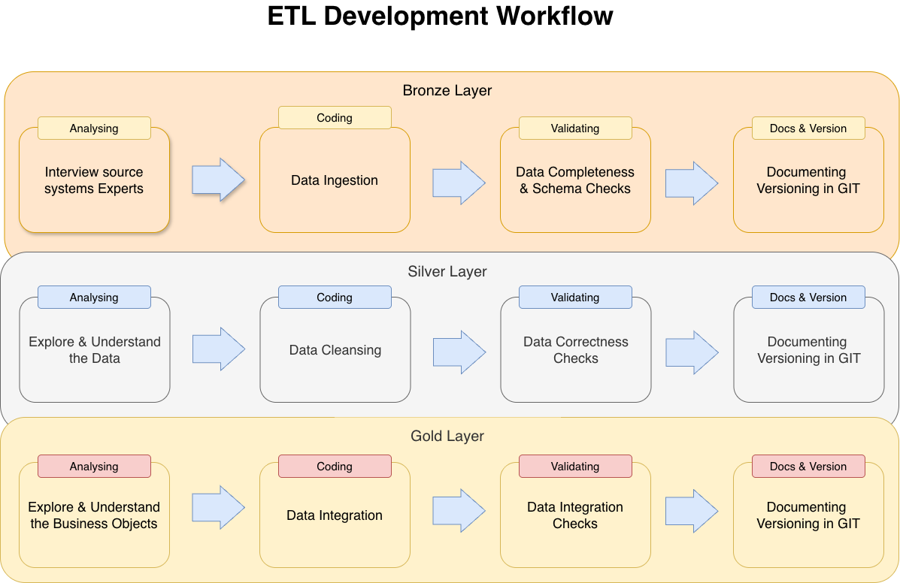

## Enterprise Sales Data Warehouse (Medallion Architecture)

This repository contains a full SQL-based Data Warehouse implemented on SQL Server.
The project demonstrates modern data engineering practices used in enterprise environments: Medallion Architecture, ETL pipelines, data quality controls, dimensional modeling, and analytical data marts.

## 1. Architecture Overview

The solution follows the Medallion model (Bronze → Silver → Gold):

Bronze Layer
Stores raw CRM and ERP datasets ingested from CSV files.
No transformations are applied; tables represent source systems as-is.

Silver Layer
Cleansed and standardized data.
Includes data validation, trimming, null handling, normalization, derived columns, and enrichment from multiple sources.
Invalid or inconsistent records are isolated into error tables.

Gold Layer
Business-ready data modeled as a star schema:
- `fact_sales`
- `dim_customers`
- `dim_products`

Designed for reporting, analytics, and ad-hoc SQL queries.

## 2. Data Flow

Data is ingested from two sources:

- CRM: sales, customer, product data
- ERP: locations, customers, product categories

Bronze → Silver pipeline includes cleansing, validation, and integration work.

Errors in product/category mapping are written to `crm_prd_cat_errors`.

Silver → Gold builds analytical models and surrogate keys.

## 3. Integration Model

CRM and ERP datasets are integrated by business keys:

Product: prd_key ↔ id

Customer: cst_id / cst_key ↔ cid

Additional attributes (birthday, gender, country) are sourced from ERP tables.

The integration logic ensures consistent business entities across systems.

## 4. Analytical Model (Gold Layer)

The Gold layer implements a star schema optimized for BI and analytical workloads.

Fact table:

- `fact_sales` with order details, dates, quantities, sales amounts.

Dimension tables:

- `dim_customers`
- `dim_products`

Surrogate keys are generated within the model.
Business logic includes sales amount calculation and product line categorization.

## 5. Technical Scope
Ingestion (Bronze)
- Source format: CSV files (ERP and CRM)
- Batch loading with TRUNCATE + INSERT
- Stored procedures orchestrate loading
- Raw model preserved without modifications

Transformation (Silver)

Includes:
- Trim & whitespace cleanup
- CHAR(10) / CHAR(13) removal
- Country normalization
- Product category extraction
- Derived columns (e.g., category_id, product line)
- Error capture tables
- Data enrichment from ERP sources

Modeling (Gold)
- Star schema (fact + dimensions)
- Surrogate keys using ROW_NUMBER
- Join logic across CRM + ERP
- Business rules implemented via stored procedures
- Views and materialized tables (depending on requirements)

## 6. Medallion Architecture Overview

This diagram provides a visual comparison of responsibilities and characteristics of each layer (Bronze, Silver, Gold), including transformation logic, load strategy, object types, and target audience.

## 7. ETL Development Workflow

This workflow illustrates the end-to-end development cycle for each Medallion layer: analysis, coding, validation, and documentation — matching real-world enterprise and consulting practices.

## 8. Repository Structure
add ------------------------------------------->

## 7. Error Handling (Product–Category Mapping)

The Silver layer includes a dedicated error-handling mechanism for detecting and isolating invalid product–category mappings between CRM and ERP systems.

Key logic:

Every product record is validated against the ERP category master.

Records with categories that do not exist in ERP are redirected to a dedicated error table: `silver.crm_prd_cat_errors`

This ensures that only products with valid category assignments proceed to analytical modeling.

Error records remain fully traceable for audit, debugging, and reconciliation.

This mechanism prevents incorrect product–category relationships from propagating into the Gold layer and supports consistent dimensional modeling.

## 9. Data Quality Controls

Implemented in the Silver layer:
- Null checks
- Domain validation (e.g., country codes, product categories)
- Format checks (dates, numeric fields)
- Duplicate detection
- Referential consistency between CRM and ERP
- Error isolation into crm_prd_cat_errors

## 10. Use Cases

This project demonstrates capabilities relevant for:
- Data Engineer
- Analytics Engineer
- SQL Developer
- ETL / DWH Engineer
- Business Intelligence Developer

## 11. Technologies

- SQL Server 2019
- T-SQL Stored Procedures
- Medallion Architecture
- Draw.io for diagrams
- Git & GitHub for versioning
- CSV as source systems
